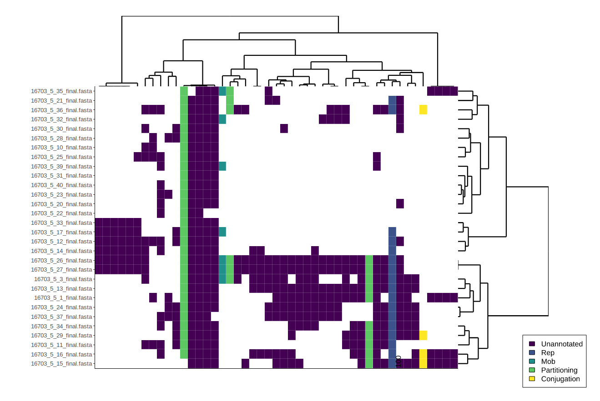

<p align="center"></p>
PlasCliques allows the profiling and comparison of plasmid content between bacterial isolates. It does this by assessing the presence of discrete groups of plasmid genes (cliques), found to be consistantly observed together over a large diverse dataset of plasmids in Enterobacteriaceae (Tokolyi *et al*., in preparation). With the provided database, draft bacterial genomes can have their plasmid cliques profiled using the <code>findCliques.py</code> script, and their output visually compared. If the user wishes to create their own clique database, <code>createCliques.py</code> can be used.

## Install
Download and run locally after ensuring the documented [dependencies](#dependencies) are installed.
```bash
git clone https://github.com/atokolyi/PlasCliques.git
```


# Discovering plasmid cliques in bacterial isolates
This script allows the discovery of plasmid cliques in bacterial assemblies. For *Enterobacteriaceae*, the provided database can be used as input, otherwise a custom clique database can be created using the scripts in the next section.
## Quick usage
This will output a list of plasmid cliques in each isolate, and a clustered visualisation of these profiles.
```bash
./findCliques.py -c EnteroCLDB -a assemblies_*.fasta
```
## Heatmap visualisation
Using the grid output option allows us to export a matrix of the cliques present in each isolate, which can then be used to create a summary visualisation (.html) of the output.
```bash
./findCliques.py -c EnteroCLDB -a assemblies_*.fasta -b pc_out.grid
Rscript misc/makeHeatmap.R pc_out.grid
```
<p align="left"></p>

## Command line options
Short | Long | Description (bold=required)
--- | --- | ---
-v | \--version | Print version number and exit
-h | \--help | Print command line options and exit
-a | \--assemblies | **Assembled bacterial contigs as input (.fasta)**
-c | \--cliquesDB | **Folder containing database of cliques**
-s | \--minCliqueSize | Minimum size (integer) of cliques included, default=2
-m | \--match | Match file to match isolate backbones against a DB of large plasmids (.match)
-l | \--outLevel | Integer level of output verbosity, 0: Cliques (default), 1: Previous + categories, 2: Previous + genes in cliques, 3: Previous + gene descriptions
-b | \--bulkOut | For matrix output, specify an output file (.grid)

# Creating a custom database of cliques
While PlasCliques comes with a database of cliques discovered in *Enterobactereaceae* plasmids, you may want to add additional plasmids, investigate a different bacterial family or perhaps have in mind an altogether different use of gene cliques (e.g. in phage, virus, human etc.). This script allows you to discover co-occurring clusters of genes (cliques) in your isolates. The output of this script is a clique database, which can then be used as input to <code>findCliques.py</code>, to discover the presence of these cliques in novel isolates. 

A brief overview of the clique finding process is that we extract genes from the isolate assemblies, cluster these genes them by similarity, optionally add annotations to the gene clusters, detect the presence of these clusters in the original isolates to create a presence/absence matrix and then use this to calculate co-occurrence similarities between genes. This yeilds a network from which we can extract highly co-occurring groups of genes (cliques).

## Quick usage
This will create folder containing a clique database (EnteroCLDB) based on the co-occurrence of the clustered genes (gene_clusters.clstr) in the investigated genomes (genomes_*.ffn).
```bash
./createCliques.py -g genomes_*.ffn -d gene_clusters.clstr -c EnteroCLDB
```

## Command line options
Short | Long | Description (bold=required)
--- | --- | ---
-v | \--version | Print version number and exit
-h | \--help | Print command line options and exit
-d | \--cdhit | **The cd-hit cluster file (.clstr)**
-g | \--genome | **Prokka output of genomes (.ffn)**
-c | \--cliquesDB | **Output folder containing database of discovered cliques**
-j | \--threshold | Jaccard inclusion threshold for COG co-occurrence weights, default=0.9
-p | \--cpus | Number of parallel processes, default=1
-a | \--annot | Database of gene annotations and categories <br> (format: gene**\t**categoryID**\t**description**\n**)


## Dependencies
Software versions in use, these or later should work fine.

**R (3.5.2)**
- heatmaply (0.15.2)
- htmlwidgets (1.3)
```R
install.packages('heatmaply')
install.packages('htmlwidgets')
```
**python3 (3.6.6)**
- Biopython (1.72)
- tqdm (4.26.0)
- joblib (0.12.5)
- python-igraph (0.7.1.post6)
```bash
pip3 install biopython
pip3 install tqdm
pip3 install joblib
pip3 install python-igraph
```
